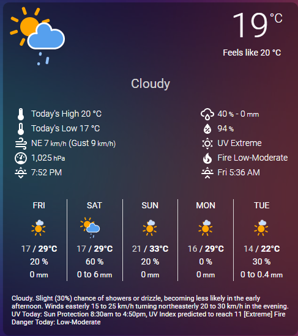
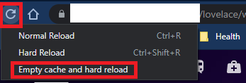
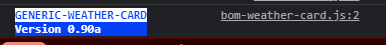
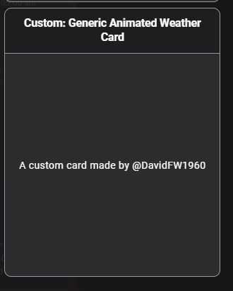
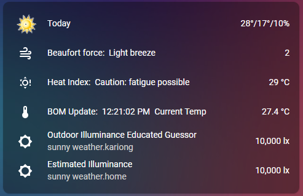
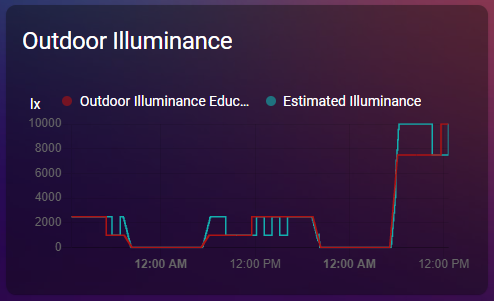

[](https://github.com/custom-components/hacs)   
# Custom Animated Weather Card for any weather provider

## IMPORTANT CHANGES

I have renamed this card to remove the emphasis on BOM. This is a generic card that works with any provider

NON-Australian Users: This card and docs has always been a generic card with an emphasis on BOM in Australia however it will work with ANY weather provider that can supply the sensors.

AUSTRALIA ONLY NOTE: I have made some changes to the docs so that this card now uses the new [BOM Component by Brendan](https://github.com/bremor/bureau_of_meteorology )
This new repo can be added to HACS See also the excellent new [BOM Radar Card by @therat here](https://github.com/Makin-Things/bom-radar-card )

I have updated the lovelace.yaml and templates (NOTE THESE AE EXAMPLES and can be customised for your needs) as well for this new component.

When you install Brendans new BOM Component, you will get sensors that look like this:
For the Observations, they will be named for the BOM Observation station like.. sensor.gosford_temperature as an example.
For the Forecast, they will be named by your local suburb determined from the entered Latitude and Longitude (which will default to your HA configuration) like sensor.kariong_icon_descriptor_0

It MAY be that there will be some new conditions from BOM. If icons are missing or you get any errors please let me know.

IF you are using the old card as well with the 7 days forecast, note the new component only provides 6 days now and additionally I have added some icons so make sure you grab the bom_icons.zip file and extract the contents to /config/www/bom_icons The animated icons for the card itself are unchanged.



This card is a modification of a fork of iammexx/home-assistant-config dark-sky-weather-card
This card provides MANY additional features as well as compatability with later versions of home assistant. 
New features not in original card include:
- Lit 2
- Only use Day time icons for forecast for future days (days 1-5)
- More icons
- Adds Locale customisation for number formats
- Added to card-picker in Lovelace
- Added option to show minimum or maximum first in forecast
- Added option to show 1 decimal place to temperatures
- Added option to display windspeeds in knots
- Show rainfall as an intensity or absolute number
- Removed leading zeros if 12hr time
- Added Wind Gust
- Can use different icon sets
- Added extra (5th) row of slots
- Added slots (optional) for UV and fire danger ratings
- Added possibility of rainfall to forecast

NOTE: This card REQUIRES any weather component that can provide the required sensors. (like the new BOM Component if in Australia)
Alternately, if you are using DarkSky (or any other provider), the important thing is that any entities parsed to the card must be provided by that platform and you should carefully check the sensor names exist. Parsing a non existant sensor to the card will cause the card to fail to display!

The Weather Card provides current and forecast weather conditions using HA sensors. You configure the card by passing in sensor entities from the weather component.

The [weather package](https://github.com/DavidFW1960/bom-weather-card/blob/master/weather.yaml ) in the repo shows configuration for this card. This package is for HA versions > 0.115.0. 

The card is very customizable.  You can configure many aspects of it's look and feel as well as which specific content to show by passing in customization flags and defining optional sensors.  Content can also be rearranged if desired. 

Hovering over a forecast day will display the daily weather summary in a tooltip popup if that option has been enabled.


## **Installation**
------------------------------
# EASY Way? use HACS
This plugin is now part of the default HACS store. You should not need to add it manually. Add this repo https://github.com/DavidFW1960/bom-weather-card

Install card from HACS as per other plugins. Note that you must add this card as a module to the resources section as per the instructions when you install the card.

NOTE: Home Assistant caches stuff in a way that seems particularly hard to break some times and HACS makes this worse unfortunately.
The rule of thumb is that when you install a new version you MUST break the cache in order for HA to load the new card. This is fairly easy to do.
In CHROME open up the Dev Tools by pressing F12
Then right click on the refresh icon in the task bar (see graphic) and you will see a menu of options. Select Empty cache and hard reload from the options. It is the only option with no shortcut!



You then need to press either CTRL+R OR CTRL+F5 at least TWICE. Then check the version in the same dev-tools. It will look something like this:



The first time you do the CTRL+F5 you might find that the version will again change back to the previous version but a second refresh will fix it.

EDIT: Latest HACS version includes a version tag in the resource which will change when you update the card so the caching fix described above is no longer necessary! Yay!

# HARD Way? manual installation as follows:
1. Add ```bom-weather-card.js``` to your ```<config-dir>/www/``` directory.  If you don't have this directory (this is your first custom card), you will need to create it.
2. Add ```/local/bom-weather-card/bom-weather-card.js?v=o.89``` type js to resources. You must increment or use a different version number for every update to break the caching of the card and make it use the new version.
# Then install the icon files
Please download [ALL icons required are in this file here](https://github.com/DavidFW1960/bom-weather-card/blob/master/weather_icons.zip) 
In addition to the amcharts ones from [here](https://www.amcharts.com/dl/svg-weather-icons/ ) I have found a few more svg icons (from [here]( https://github.com/SouthernWolf95/amCharts-SVG-Icons-Additions ) and also via the Home Assistant Forums [here]( https://community.home-assistant.io/t/animated-weather-icons-svg-for-all-dark-sky-values/150702 ) to use in this component. Put them in ```<config-dir>/www/icons/weather_icons``` and then sub folders animated and static.  Create the directories if necessary. 

I used to recommend downloading Download the amcharts icons from https://www.amcharts.com/dl/svg-weather-icons/ however if you don't use my zip file version some icons will be missing.

To use the basic card, you will also need the /<config-dir>/www/icons/bom_icons which are contained in [bom_icons.zip](https://github.com/DavidFW1960/bom-weather-card/blob/master/bom_icons.zip )

You should end up with the following folders:
This structure is after all configuration is done. If you install via HACS you must still configure the package/yaml and icons manually.
HACS:-
~~~~
└── ...
└── configuration.yaml
└── packages
    └── weather.yaml
└── www
    └── community
        └── bom-weather-card
            └── bom-weather-card.js
            └── bom-weather-card.js.gz
    └── icons
	└── bom_icons            ###### Containing bom_icons.zip unzipped (ONLY if using the basic card and icons)
	└── weather_icons
		└── animated     ###### Containing the animated icons from weather_icons.zip animated directory
		└── static       ###### Containing the animated icons from weather_icons.zip static directory
~~~~
This structure is after all configuration is done. You must still configure the package/yaml and icons manually.
MANUAL INSTALL:- 
~~~~
└── ...
└── configuration.yaml
└── packages
    └── weather.yaml
└── www
    └── bom-weather-card.js
    └── icons
	└── bom_icons            ###### Containing bom_icons.zip unzipped (ONLY if using the basic card and icons)
	└── weather_icons
		└── animated     ###### Containing the animated icons from weather_icons.zip animated directory
		└── static       ###### Containing the animated icons from weather_icons.zip static directory

~~~~
IF YOU USE the SAMBA addin in Home Assistant, the ICON directory will be hidden by default. Go to the configuration of the addon and remove the exclusion of icons and restart the addon otherwise you can't create the directory.

## **Configuration**
------------------------------
1. All configuration for the component is done via the GUI!

It seems the new BOM API actually will generate a forecast for ANY location/Suburb in Australia and observations for defined observation stations. The nearest station is used.

The next two steps are completed differently based on the version of HA you are using:
- Pre 0.84 or if using yaml mode in 0.84 or above : Add to your ui-lovelace.yaml file.
- Using storage mode in 0.84 or above use the GUI Editor to add the reference and definition to the config.

2. Add the card reference to resources
If you installed using HACS, the resources should be updated automatically (see below)

   **Note: Ensure type is set to module and not js**  
   **Note: /local/ points to the ```<config-dir>/www/``` dir.**
   **Note: /hacsfiles/ points to the ```<config-dir>/www/community/``` dir.**

Note that neither /local/ of /hacsfiles/ physically exist! The directory structure is as per above.

For a HACS Installation:
~~~~
resources:
  - url: /hacsfiles/bom-weather-card/bom-weather-card.js
    type: module
~~~~

For the manual installation:
~~~~
resources:
  - url: /local/custom_ui/bom-weather-card.js?v=0.1
    type: module
~~~~

To use the package, copy weather.yaml to your packages folder as per above. Create that directory if it doesn't exist.
Edit weather.yaml for your sensor names and ensure you include packages in configuration.yaml:
~~~~
homeassistant:
  packages: !include_dir_named packages
~~~~

3. Add the card definition: You can add this card from the card picker but need to configure the entities and flags in YAML. There are required / optional and flag entries.
NOTE: All my values refer to Gosford observation entities and Kariong forecast.. You will need to edit these to match your sensors names.**
This card has been added to the custom-card-picker in Lovelace
	

	
**An example configuration is in lovelace.yaml - this can be pasted into the manual card configuration in the GUI editor**
If you paste it in the raw editor or in a yaml file, take care with the indenting.

Required entries must be present 
in your configuration.  The card will not work at all if any of these lines are missing. **EDIT gosford/kariong to match your observations/forecasts**
~~~~
type: custom:bom-weather-card
title: BOM Weather
entity_current_conditions: sensor.kariong_icon_descriptor_0
entity_temperature: sensor.gosford_temp
entity_forecast_high_temp_1: sensor.kariong_temp_max_1
entity_forecast_high_temp_2: sensor.kariong_temp_max_2
entity_forecast_high_temp_3: sensor.kariong_temp_max_3
entity_forecast_high_temp_4: sensor.kariong_temp_max_4
entity_forecast_high_temp_5: sensor.kariong_temp_max_5
entity_forecast_icon_1: sensor.kariong_icon_descriptor_1
entity_forecast_icon_2: sensor.kariong_icon_descriptor_2
entity_forecast_icon_3: sensor.kariong_icon_descriptor_3
entity_forecast_icon_4: sensor.kariong_icon_descriptor_4
entity_forecast_icon_5: sensor.kariong_icon_descriptor_5
entity_forecast_low_temp_1: sensor.kariong_temp_min_1
entity_forecast_low_temp_2: sensor.kariong_temp_min_2
entity_forecast_low_temp_3: sensor.kariong_temp_min_3
entity_forecast_low_temp_4: sensor.kariong_temp_min_4
entity_forecast_low_temp_5: sensor.kariong_temp_min_5
entity_summary_1: sensor.kariong_short_text_1
entity_summary_2: sensor.kariong_short_text_2
entity_summary_3: sensor.kariong_short_text_3
entity_summary_4: sensor.kariong_short_text_4
entity_summary_5: sensor.kariong_short_text_5
entity_sun: sun.sun
~~~~

Optional entries add components to the card. My BOM area (Gosford) does not include visibility or pressure. Edit entities to your correct sensor names. Replace Gosford with your name.

***Please note entity_pop_1 to 5 lines must all be included for daily pop (probability of precip) to show in forecast

***Also note that for daily possible rainfall to show, entity_possible_today as well as the 5 entity_pos_1 to 5 lines are needed.

***Also note that the name for tomorrow's possible rainfall has changed!

***Defining BOTH entity_pop_intensity and entity_pop_intensity_rate will give an INVALID message in the pop slot if defined.

~~~~
# entity_visibility: If provided from a different source
entity_daytime_high: sensor.bom_today_max
entity_daytime_low: sensor.bom_today_min
entity_wind_bearing: sensor.gosford_wind_direction
entity_wind_speed: sensor.gosford_wind_speed_kilometre
entity_wind_gust: sensor.gosford_gust_speed_kilometre
# entity_wind_speed_kt: sensor.gosford_wind_speed_knot
# entity_wind_gust_kt: sensor.gosford_gust_speed_knot
entity_humidity: sensor.gosford_humidity
# entity_pressure: sensor.nodemcu_lounge_bme280_seapressure I get pressure from a NodeMCU. Bom does not supply this!
entity_apparent_temp: sensor.gosford_temp_feels_like
entity_daily_summary: sensor.kariong_extended_text_0
entity_pop: sensor.kariong_rain_chance_0
entity_pop_intensity: sensor.gosford_rain_since_9am
entity_possible_today: sensor.kariong_rain_amount_range_0
entity_pos_1: sensor.kariong_rain_amount_range_1
entity_pos_2: sensor.kariong_rain_amount_range_2
entity_pos_3: sensor.kariong_rain_amount_range_3
entity_pos_4: sensor.kariong_rain_amount_range_4
entity_pos_5: sensor.kariong_rain_amount_range_5
entity_pop_1: sensor.kariong_rain_chance_1
entity_pop_2: sensor.kariong_rain_chance_2
entity_pop_3: sensor.kariong_rain_chance_3
entity_pop_4: sensor.kariong_rain_chance_4
entity_pop_5: sensor.kariong_rain_chance_5
entity_fire_danger_summary: sensor.kariong_fire_danger_0
~~~~

**Note:** The following entries require template sensors.  
~~~~
entity_current_text: sensor.bom_current_text
entity_uv_alert: sensor.bom_uv_alert
entity_fire_danger: sensor.bom_fire_danger
entity_uv_alert_summary: sensor.uv_cat_formatted
~~~~

**Example template sensors:** You can call template sensors whatever you want so long as you use the same name in the card config. (Included in weather.yaml) 
I don't believe templates for areas with two fire danger areas like Perth are required anymore with the new forecasts.
NOTE ALSO that the minimum temperature 'disappears' in the early afternoon from the BOM feed. ALso the UV and fire information becomes unknown around 10PM. I have used Template sensors toselect the next day when this happens but have not done this in this latest package (too little benefit!)
I am also parsing the ACTUAL minimum and maximum temperatures to the card rather than the forecast ones for the current day. If you don't like that, feel free to make your own sensors. (See the minimal card template for examples)

These templates are EXAMPLES. Adjust and adapt as required. Up-to-date templates will always be in the templates.md file.
~~~~~
sensor:
  - platform: template
    sensors:
      bom_current_text:
        value_template: >
             
            {{ val | title }}

      uv_cat_formatted:
        value_template: "{{ states('sensor.kariong_uv_category_0') | replace('veryhigh', 'Very High') | title }}"

      bom_uv_alert:
        value_template: >
            UV Today: Sun Protection 
            {{ as_timestamp(states('sensor.kariong_uv_start_time_0'),default='n/a') | timestamp_custom(' %I:%M%p',default='n/a') | lower | replace(" 0", "") }} to {{ as_timestamp(states('sensor.kariong_uv_end_time_0'),default='n/a') | timestamp_custom(' %I:%M%p',default='n/a') | lower | replace(" 0", "") }}, UV Index predicted to reach {{ states('sensor.kariong_uv_max_index_0') }} [{{ states('sensor.uv_cat_formatted') }}]

      bom_fire_danger:
        value_template: "Fire Danger Today: {{ states('sensor.kariong_fire_danger_0') }}"

~~~~~

Flags are used to control the look and feel of the card (See below for details)
~~~~
locale: en
static_icons: false
tooltip_bg_color: 'rgb( 75,155,239)'
tooltip_border_color: orange
tooltip_border_width: 3
tooltip_caret_size: 10
tooltip_fg_color: '#fff'
tooltip_left_offset: -12
tooltip_width: 100
tooltips: true
old_daily_format: false
time_format: 24
show_beaufort: true
old_icon: "true"   # must be true in quotes for old icons to be rendered
show_decimals: false
~~~~

**Flags**
--------------------------
| Flag                     | Values                             | Usage                                                                       |
|--------------------------|------------------------------------|-----------------------------------------------------------------------------|
| locale                   | **en** / fr / de / etc.            | Sets locale display of day names and time formats                           |
| static_icons             | true / **false**                   | Switches between static (true) and animated (false) icons                   |
| tooltips                 | true / **false**                   | Enables tooltips that show daily forecast summary                           |
| tooltip_width            | **110**                            | Sets the width of the tooltip in px                                         |
| tooltip_bg_color         | **rgb( 75,155,239)**               | Sets the background color of the tooltip (rgb / # / color)                  |
| tooltip_fg_color         | **#fff**                           | Sets the foreground color of the tooltip (rgb / # / color)                  |
| tooltip_border_color     | **rgb(255,161,0)**                 | Sets the color of the tooltip border including the caret (rgb / # / color)  |
| tooltip_border_width     | **1**                              | Sets the width of the tooltip border in px                                  |
| tooltip_caret_size       | **5**                              | Sets the size of the caret (the little arrow pointing down) in px           |
| tooltip_left_offset      | **-12**                            | Sets the offset of the left edge of the tooltip. In negative (-)x           |
| refresh_interval         | **30** / Integer value             | Sets the nuber of seconds between card value refreshes                      |
| old_daily_format         | true / **false**                   | Sets the format of the daily high & low temps to be stacked (old format)    |
| show_beaufort            | true / **false**                   | Shows Beaufort Scale wind information                                       |
| show_separator           | true / **false**                   | Shows separator between current conditions columns and current temp / Icon  |
| tempformat               | highlow / **noentry**              | Any setting for this flag will trigger the option to show max/min in daily  |
| time_format              | **locale** / 12 / 24               | Sets the format sunset and sunrise times. locale format is the default.     |
| temp_top_margin          | **0px** / px or em value           | Sets the top margin of the Temperature.                                     |
| temp_font_weight         | **300** / numeric value            | Sets the font weight of the Temperature.                                    |
| temp_font_size           | **4em** / em value                 | Sets the font size of the Temperature.                                      |
| temp_right_pos           | **0.85em** / px or em value        | Sets the right position of the Temperature.                                 |
| temp_uom_top_margin      | **-12px** / px or em value         | Sets the top margin of the Temperature Unit of Meaure.                      |
| temp_uom_right_margin    | **4px** / px or em value           | Sets the right margin of the Temperature Unit of Measure.                   |
| apparent_top_margin      | **45px** / px or em value          | Sets the top margin of the apparent (feels Like) temperature                |
| apparent_right_pos       | **1em** / px or em value           | Sets the right position of the apparent (feels Like) temperature            |
| apparent_right_margin    | **1em** / px or em value           | Sets the right margin of the apparent (feels Like) temperature              |
| current_text_top_margin  | **4.5em** / px or em value         | Sets the top margin of the current temperature text                         |
| current_text_left_pos    | **0px** / px or em value           | Sets the left position of the current temperature text                      |
| current_text_font_size   | **1.5em** / em value               | Sets the font size of the current temperature text                          |
| current_text_alignment   | **center** / left, right or center | Sets the alignment of current text                                          |
| current_text_width       | **100%** / px, em or %             | Sets the width of current text                                              |
| current_data_top_margin  | **10em** / px or em value          | Sets the top margin of the current data blocks                              |
| large_icon_top_margin    | **-3.2em** / px or em value        | Sets the top margin of the current conditions icon                          |
| large_icon_left_pos	     | **0px** / px or em value           | Sets the left position of the current conditions icon                       |
| separator_top_margin     | **6em** / px or em value           | Sets the top margin of the separator line                                   |
| summary_top_padding      | **2em** / px or em                 | Sets the gap between the forecast and summary text                          |
| summary_font_size        | **0.8em** / px or em               | Sets the font size for the summary text                                     |
| slot_l1                  | **daytime_high**                   | Sets the value used in current conditions slot l1 : See slots for more info |
| slot_l2                  | **daytime_low**                    | Sets the value used in current conditions slot l2 : See slots for more info |
| slot_l3                  | **wind**                           | Sets the value used in current conditions slot l3 : See slots for more info |
| slot_l4                  | **pressure**                       | Sets the value used in current conditions slot l4 : See slots for more info |
| slot_l5                  | **sun_next**                       | Sets the value used in current conditions slot l4 : See slots for more info |
| slot_r1                  | **pop**                            | Sets the value used in current conditions slot r1 : See slots for more info |
| slot_r2                  | **humidity**                       | Sets the value used in current conditions slot r2 : See slots for more info |
| slot_r3                  | **uv_summary**                     | Sets the value used in current conditions slot r3 : See slots for more info |
| slot_r4                  | **fire_summary**                   | Sets the value used in current conditions slot r4 : See slots for more info |
| slot_r5                  | **sun_following**                  | Sets the value used in current conditions slot r4 : See slots for more info |
| old_icon                 | **"true"** / hybrid or false       | Sets card to render old icons. Must use quotes                              |
| show_decimals            | **false** / true                   | Sets card to render current and apparent temperature to 1 decimal place     | 
                                                                | if true.                                                                    |

**Slots**
--------------------------
The current condition columns are specified by 'slots'.  There are 5 left column slots (designated l1 - l5) and 5 right column
slots (designated r1 - r5).  There are currently 10 possible values that can be assigned to a slot.  These are:
- daytime_high
- daytime_low
- wind
- wind_kt
- visibility
- sun_next (the next sun event ... sunset or sunrise)
- sun_following (The following sun event ... if sun_next is a sunset then this will be the following sunrise and vice versa)
- pop (probability of precipitation) Shows % possible rainfall today and the actual recorded rainfall
- popforecast Shows % possible rainfall today and forecast rainfall
- humidity
- pressure
- uv_summary
- fire_summary
- possible_today (possible rainfall today)
- possible_tomorrow (possible rainfall tomorrow)
- empty (empty slot... the slot below does not rise to fill the space)
- remove (same as empty but the slot below rises to take the place of the slot)

If configuring with Slots please ensure to fill all available positions, the slots that you do not need can be filled with "remove" to ensure that they remain blank.

[My FULL Lovelace configuration for this card is here](https://github.com/DavidFW1960/bom-weather-card/blob/master/lovelace.yaml) Cut and paste it into your lovelace.

## MINIMAL CARD Example
Please be aware I may update the templates and lovelace config for these cards without making a new release so if you watch this repo you will get notified when this happens.

See these templates:
~~~~~
sensor:
  - platform: template
    sensors:
      bom_forecast_0:
        friendly_name: "Today"
        value_template: >
              
              
          {{ max|round(0,default='none')}}°/{{ min|round(0,default='none')}}°/{{states('sensor.kariong_rain_chance_0')|round(0,default='none')}}%
        entity_picture_template: >-
          {%- if states('sun.sun') == 'below_horizon' and (states('sensor.kariong_icon_descriptor_0') == 'fog' or states('sensor.kariong_icon_descriptor_0') == 'haze' or states('sensor.kariong_icon_descriptor_0') == 'hazy' or states('sensor.kariong_icon_descriptor_0') == 'light-showers' or states('sensor.kariong_icon_descriptor_0') == 'partly-cloudy' or states('sensor.kariong_icon_descriptor_0') == 'showers' or  states('sensor.kariong_icon_descriptor_0') == 'light_shower' or states('sensor.kariong_icon_descriptor_0') == 'shower' or states('sensor.kariong_icon_descriptor_0') == 'light_showers' or states('sensor.kariong_icon_descriptor_0') == 'partly_cloudy') -%}
          {{ '/local/icons/bom_icons/' ~ states('sensor.kariong_icon_descriptor_0') ~ '-night.png' }}
          
          {{ '/local/icons/bom_icons/' ~ states('sensor.kariong_icon_descriptor_0') ~ '.png' }}
          

      bom_forecast_1:
        friendly_name_template: >
          
          {{ date | timestamp_custom('Tomorrow (%-d/%-m)',default='n/a') }}
        value_template: >
          {{states('sensor.kariong_temp_max_1')|round(0)}}°/{{states('sensor.kariong_temp_min_1')|round(0)}}°/{{states('sensor.kariong_rain_chance_1')|round(0)}}%
        entity_picture_template: >-
          {{ '/local/icons/bom_icons/' ~ states('sensor.kariong_icon_descriptor_1') ~ '.png' }}

      bom_forecast_2:
        friendly_name_template: >
          
          {{ date | timestamp_custom('%A (%-d/%-m)',default='n/a') }}
        value_template: >
          {{states('sensor.kariong_temp_max_2')|round(0)}}°/{{states('sensor.kariong_temp_min_2')|round(0)}}°/{{states('sensor.kariong_rain_chance_2')|round(0)}}%
        entity_picture_template: >-
          {{ '/local/icons/bom_icons/' ~ states('sensor.kariong_icon_descriptor_2') ~ '.png' }}

      bom_forecast_3:
        friendly_name_template: >
          
          {{ date | timestamp_custom('%A (%-d/%-m)',default='n/a') }}
        value_template: >
          {{states('sensor.kariong_temp_max_3')|round(0)}}°/{{states('sensor.kariong_temp_min_3')|round(0)}}°/{{states('sensor.kariong_rain_chance_3')|round(0)}}%
        entity_picture_template: >-
          {{ '/local/icons/bom_icons/' ~ states('sensor.kariong_icon_descriptor_3') ~ '.png' }}

      bom_forecast_4:
        friendly_name_template: >
          
          {{ date | timestamp_custom('%A (%-d/%-m)',default='n/a') }}
        value_template: >
          {{states('sensor.kariong_temp_max_4')|round(0)}}°/{{states('sensor.kariong_temp_min_4')|round(0)}}°/{{states('sensor.kariong_rain_chance_4')|round(0)}}%
        entity_picture_template: >-
          {{ '/local/icons/bom_icons/' ~ states('sensor.kariong_icon_descriptor_4') ~ '.png' }}

      bom_forecast_5:
        friendly_name_template: >
          
          {{ date | timestamp_custom('%A (%-d/%-m)',default='n/a') }}
        value_template: >
          {{states('sensor.kariong_temp_max_5')|round(0)}}°/{{states('sensor.kariong_temp_min_5')|round(0)}}°/{{states('sensor.kariong_rain_chance_5')|round(0)}}%
        entity_picture_template: >-
          {{ '/local/icons/bom_icons/' ~ states('sensor.kariong_icon_descriptor_5') ~ '.png' }}

      bom_forecast_6:
        friendly_name_template: >
          
          {{ date | timestamp_custom('%A (%-d/%-m)',default='n/a') }}
        value_template: >
          {{states('sensor.kariong_temp_max_6')|round(0,default='unknown')}}°/{{states('sensor.kariong_temp_min_6')|round(0,default='unknown')}}°/{{states('sensor.kariong_rain_chance_6')|round(0,default='unknown')}}%
        entity_picture_template: >-
          {{ '/local/icons/bom_icons/' ~ states('sensor.kariong_icon_descriptor_6') ~ '.png' }}

      bom_today_max:
        value_template: >
          {{ state_attr('sensor.today_temp_bom', 'max_value') }}

      bom_today_min:
        value_template: >
          {{ state_attr('sensor.today_temp_bom', 'min_value') }}

  - platform: average
    name: today_temp_bom
    entities:
      - sensor.gosford_temp
    start: '{{ now().replace(hour=0).replace(minute=0).replace(second=0) }}'
    end: '{{ now() }}'
~~~~~

NOTE I am using a [custom component average](https://github.com/Limych/ha-average ) for the bom_today_max and bom_today_min sensors.
See that for day 0, if the min/max is missing from the forecast it uses the average component.
In the weather.yaml package, I use the statistics sensor instead of the custom average component (and provide code for both so you can choose)..
You can then display these on an entities card like this:
Note this uses a custom hui_element card in case BOM isn't publishing day 6

~~~~~
type: entities
title: BOM Forecast
show_header_toggle: false
entities:
  - sensor.bom_forecast_0
  - sensor.bom_forecast_1
  - sensor.bom_forecast_2
  - sensor.bom_forecast_3
  - sensor.bom_forecast_4
  - sensor.bom_forecast_5
  - type: 'custom:hui-element'
	card_type: conditional
	conditions:
	  - entity: sensor.bom_forecast_6
		state_not: "unknown°/unknown°/unknown%"
	card:
	  type: entities
	  card_mod:
		style: |
		  ha-card {
			box-shadow: none;
			--ha-card-background: rgba(0, 0, 0, 0);
			margin: -16px -16px -16px -16px;
		  }
	  entities:
	  - entity: sensor.bom_forecast_6
~~~~~


## Extra Info Card example



I show some additional info on a seperate card. This utilises the Beaufort, Heat Index templates as well as an illuminance computation.
I have added an illuminance package derived from [Brian Hanifin's work here](https://community.home-assistant.io/t/outdoor-illuminance-template-sensor/228581 )

I also used Phil Bruckners illuminance component for [comparison using met.no here](https://github.com/pnbruckner/ha-illuminance )

I use a history graph to display these



Please be aware I may update the templates and lovelace config for these cards without making a new release so if you watch this repo you will get notified when this happens.

I am hoping to refine this and maybe use to assist with turning on an indoor light.

My Lovelace Code to display these is here:
(Note I am using the config-template-custom-card also in HACS by Ian)
~~~~
          - type: 'custom:config-template-card'
            variables:
              - states['sensor.beaufort'].state
              - states['sensor.heatindex'].state
              - states['sensor.heatindexrating'].state
              - states['sensor.gosford_temp'].attributes['issue_time']
            entities:
              - sensor.beaufort
              - sensor.heatindex
              - sensor.heatindexrating
              - sensor.gosford_temp
            card:
              type: 'custom:hui-entities-card'
              entities:
                - entity: sensor.bom_forecast_0
                - entity: sensor.beaufort
                  name: "${'Beaufort force:' + '\xa0'.repeat(2) + (vars[0] == 12 ? 'Hurricane Force' : vars[0] == 11 ? 'Violent Storm' : vars[0] == 10 ? 'Storm, whole gale' : vars[0] == 9 ? 'Strong/severe gale' : vars[0] == 8 ? 'Gale/ fresh gale' : vars[0] == 7 ? 'High wind, moderate/near gale' : vars[0] == 6 ? 'Strong breeze' : vars[0] == 5 ? 'Fresh breeze' : vars[0] == 4 ? 'Moderate breeze' : vars[0] == 3 ? 'Gentle breeze' : vars[0] == 2 ? 'Light breeze' : vars[0] == 1 ? 'Light air' : 'Calm')}"
                - entity: sensor.heatindex
                  name: "${'Heat Index:' + '\xa0'.repeat(2) + vars[2]}"
                - entity: sensor.gosford_temp
                  name: "${'BOM Update:' + '\xa0'.repeat(2) + ( new Date(vars[3]).toLocaleTimeString('en-US') ) + '\xa0'.repeat(2) + 'Current Temp' }"
                - entity: sensor.illuminance
                  type: "custom:template-entity-row"
                  secondary: "{{ states('weather.kariong') }} weather.kariong"
                  state: "{{ '{:,}'.format((states('sensor.illuminance'))|int) }} lx"
                  icon: mdi:brightness-5
                - entity: sensor.estimated_illuminance
                  type: "custom:template-entity-row"
                  secondary: "{{ states('weather.home') }} weather.home"
                  state: "{{ '{:,}'.format((states('sensor.estimated_illuminance'))|int) }} lx"
                  icon: mdi:brightness-5
          - type: history-graph
            title: Outdoor Illuminance
            hours_to_show: 48
            refresh_interval: 300
            entities:
              - sensor.illuminance
              - sensor.estimated_illuminance
~~~~
